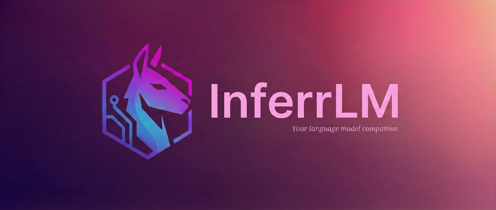

## InferrLM (Previously Inferra)
<p>
  <a href="" target="_blank"></a>
  <a href="https://opensource.org/licenses/AGPL-3.0" target="_blank"></a>
</p>
<p>
  
</p>

InferrLM is a mobile application that brings LLMs & SLMs directly to your Android & iOS device and lets your device act as a local server. Cloud-based models like Claude, DeepSeek, Gemini and ChatGPT are also supported. File attachments with RAG are also well-supported for local models.

[](https://play.google.com/store/apps/details?id=com.gorai.ragionare)

[](https://apps.apple.com/us/app/inferra/id6754396856)

If you want to support me and the development of this project, you can donate to me through [Ko-fi](https://ko-fi.com/subhajitgorai). Any amount is appreciated.

## Features

### Core Inference
- Local inference through llama.cpp with support for GGUF models. More inference engines are planned for future releases. You can become a contributor by implementing additional ones. See the [contributions guide](#contributing) below.
- Seamless integration with cloud-based models from OpenAI, Gemini, Anthropic and DeepSeek. You need your own API keys and an InferrLM registered account for remote models. Using remote models is optional.
- Customizable base URLs for OpenAI-compatible providers like Ollama, LM Studio, OpenRouter, Groq and Together AI. This allows you to use local inference servers or alternative API endpoints.
- Apple Foundation support for compatible iOS devices, for Apple Intelligence supported devices when available.

### Vision and Multimodal
- Vision support through multimodal models with their corresponding projector (mmproj) files which you can find [here](https://github.com/ggml-org/llama.cpp). SmolVLM2 and its multimodal projector file are included by default in the Models -> Download Models tab. Both files are combined, meaning downloading "SmolVLM2" will also download its projector, but you can cancel either download if needed.
- Built-in camera (based on expo-camera) lets you capture pictures directly in the app and send them to models. Clicked pictures are saved to your gallery by default.

### Document Processing and RAG
- RAG (Retrieval-Augmented Generation) support for enhanced document understanding and context-aware responses.
- File attachment support with a built-in document extractor that performs OCR locally on all pages of your documents and extracts text content to send to models (local or remote).
- Document ingestion system that processes and indexes your files for efficient retrieval during conversations.

### Local Server
- Built-in HTTP server that exposes REST APIs for accessing your models from any device on your WiFi network.
- Server can be started from the Server tab with configuration options for network access and auto-start.
- Share your InferrLM chat interface with computers, tablets, or other devices through a simple URL or QR code.
- Full API documentation is available [HERE](docs/REST_APIs.md) and at the server homepage when running.
- A command-line interface tool is available at [github.com/sbhjt-gr/inferra-cli](https://github.com/sbhjt-gr/inferra-cli) that demonstrates how to build applications using these REST APIs.

### Model Management
- Download manager that fetches models directly from HuggingFace. Cherry-picked model list optimized for running on edge devices available in Models -> Download Models tab.
- Downloaded models appear in the chat screen model selector and the "Stored Models" tab under the "Models" section.
- Import models from local storage or download from custom URLs.
- Model operations including load, unload, reload, and refresh through the app or REST API.

### Chat Experience
- Messages support editing, regeneration, copy functionality and markdown rendering.
- Code generated by models is rendered in codeblocks with clipboard copying functionality.
- Chat history management with the ability to create, save, and organize conversations.
- Real-time streaming responses for both local and remote models.

## Getting Started
If you want to contribute or just try to run it locally, follow the guide below. Please adhere to the rules of the <a href="https://github.com/sbhjt-gr/inferra/blob/main/LICENSE">LICENSE</a> because you are not supposed to just `git clone` and pass it as your own work.

### Prerequisites

- Node.js (>= 16.0.0, < 23.0.0)
- npm or yarn
- Expo CLI
- Android Studio (for Android development)
- Xcode (for iOS development)

### Installation

1. **Clone the repository**
   ```bash
   git clone https://github.com/sbhjt-gr/inferra
   cd inferra
   ```

2. **Install dependencies**
   ```bash
   yarn install
   ```

3. **Set up environment variables**
